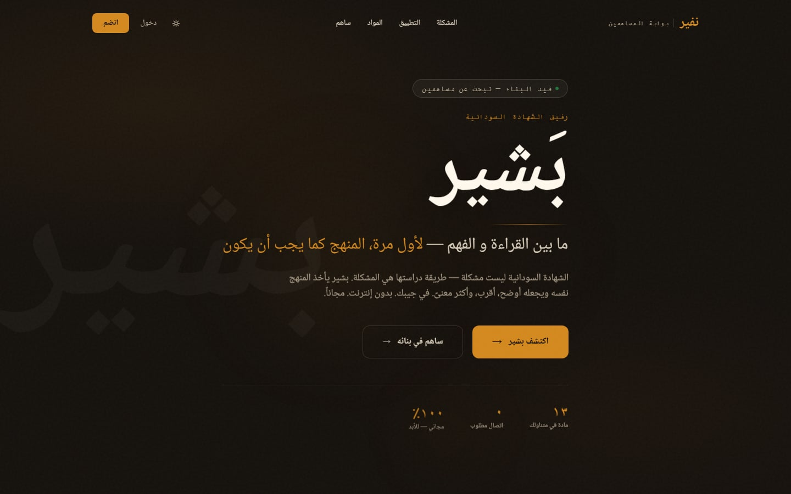
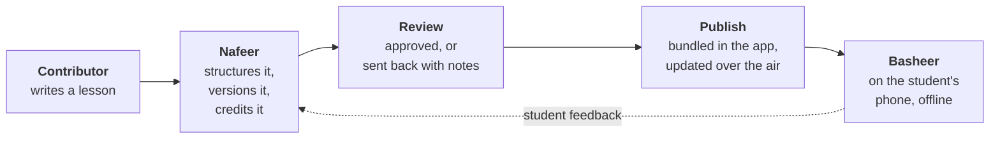
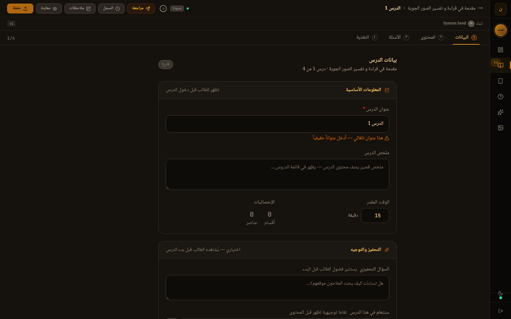
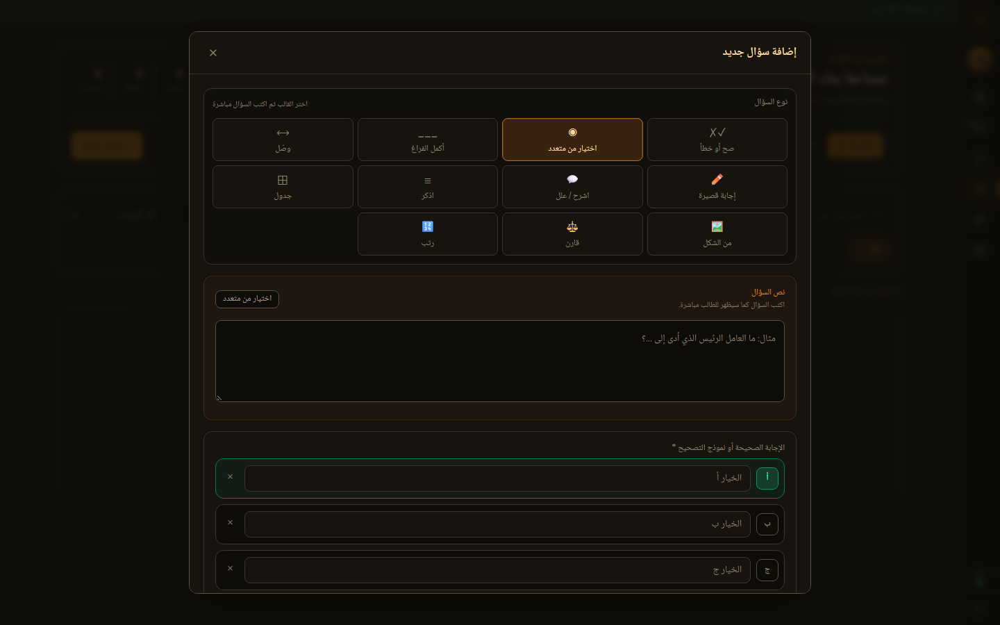
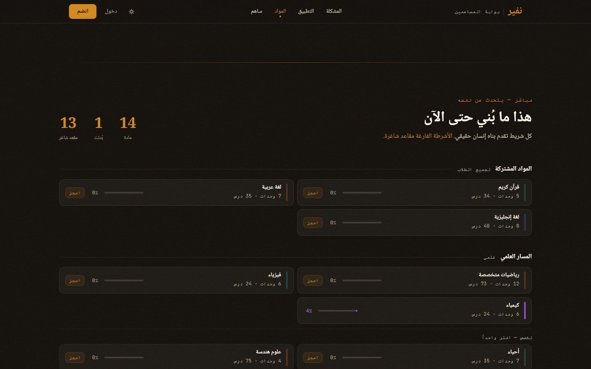
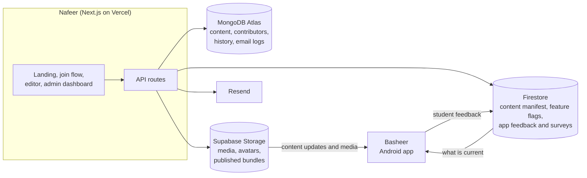

<div align="center">


# Nafeer · نفير

### Contributing to education should be easy.

Nafeer is the contribution platform behind **Basheer**, a free, offline-first study app<br/>
for Sudanese high-school students. People who know a subject write the lessons.<br/>
Nafeer takes care of everything between their keyboard and a student's phone.

[**Visit the site**](https://nafeer4sudan.site) · [**Try the Basheer preview**](https://nafeer4sudan.site/demo) · [**Become a contributor**](https://nafeer4sudan.site/prejoin)

</div>

<br/>



---

## First, Basheer

**Basheer** (بشير) is a study companion for the Sudanese high-school certificate (الشهادة السودانية), the exam that decides what a student can go on to study. It takes its inspiration from Duolingo: short sessions, daily habits, practice that adapts to you. Everything else about it is shaped around the Sudanese student. It is in active development.

<table>
<tr>
<td width="50%" valign="top">

### 📴 Offline first

A student in Sudan cannot count on a connection, so Basheer does not ask for one. The curriculum ships inside the app. Lessons, practice and progress all work with no internet at all.

</td>
<td width="50%" valign="top">

### 🧠 Intelligent by design

Basheer is built to notice what a student has studied and where they stumble, bring a concept back just before it would be forgotten, and assemble practice around the gaps. All of it runs on the phone.

</td>
</tr>
<tr>
<td valign="top">

### 📚 The curriculum, made visible

Basheer does not replace the Sudanese curriculum. It takes the same units and lessons students already study and gives them structure, illustration, worked examples and connections between ideas.

</td>
<td valign="top">

### 🎯 Built around the exam that matters

Past ministry exams, organised by subject, unit and difficulty, sit at the centre of the question bank, alongside a swipeable feed of bite-sized cards for the minutes between everything else.

</td>
</tr>
</table>

> A student who memorises to answer becomes a student who understands to build.

## Then, Nafeer

An app like that is only as good as what is inside it: thousands of lessons, questions and revision cards across fourteen subjects. No one person can write all of that.

In Sudan, a *nafeer* (نفير) is what happens when a community gathers to build something none of them could build alone: a house, a harvest. This project borrows the word on purpose.

**Nafeer is how that community gets its knowledge into Basheer.**

### Who it is for

Not only teachers. The people best placed to explain a subject are often the ones who went on to use it:

- **Teachers and educators**, who know where students get lost.
- **Graduates and university students**, who sat this exam recently and remember what they wish someone had told them.
- **Specialists in their field**: the engineer who can show what a physics law is actually for, the doctor who can make a biology chapter mean something, the programmer, the accountant, the historian.

You do not need to be a teacher. You need to know your subject and be able to explain it to someone hearing it for the first time.

The point of all of it is simple: somewhere there is a student whose plans depend on this exam, and a clear explanation from someone who has been where they want to go can change how far they get.

### What it takes off your hands

Someone who wants to help should be able to sit down and write a lesson. They should not have to learn what a database is, how an app stores a lesson, or how an update reaches a phone. **Nafeer exists so they never have to.**

## Nafeer at a glance

<table>
<tr>
<td width="50%" valign="top">

### ✍️ Write, don't configure

Lessons are assembled from simple blocks: a paragraph, a worked example, a formula, an image, a highlighted definition. Questions come as eleven ready-made formats. No code, no file formats, nothing to install.

</td>
<td width="50%" valign="top">

### 🧭 Never a blank page

Each subject arrives already laid out from the official curriculum, with every unit and lesson waiting to be filled. Contributors always know what exists and what is missing.

</td>
</tr>
<tr>
<td valign="top">

### 🏅 Your work, under your name

Every lesson records who wrote it, who edited it and who reviewed it. Contributors get a public profile, live statistics, an activity calendar, and badges for real milestones.

</td>
<td valign="top">

### ✅ Reviewed before it ships

Nothing reaches a student without approval. Edit an approved lesson, even by one word, and it goes back through review. Every change is versioned, with a full history.

</td>
</tr>
<tr>
<td valign="top">

### 📶 Built for weak connections

The core curriculum ships inside the app. When content is added or improved later, phones fetch only what changed, not the whole subject again.

</td>
<td valign="top">

### 🤝 One system, two halves

Nafeer and Basheer were designed together. The editor can only produce what the app can display, and feedback from students flows back to the people writing for them.

</td>
</tr>
</table>

## From a contributor to a student



1. **Write.** A contributor fills in a lesson, adds questions and study cards, and saves.
2. **Submit.** One button sends it for review.
3. **Review.** A project admin approves it or returns it with notes.
4. **Publish.** Approved content becomes part of Basheer. The base curriculum is bundled into the app itself; later additions and corrections are packaged as small updates containing only what changed.
5. **Learn.** A student opens the lesson, with or without a connection.

## A look inside

<table>
<tr>
<td width="50%" valign="top">



**The lesson editor.** Four steps: details, content, questions, study cards. Review, history, notes, preview and save sit along the top, with the author's name and version number just beneath.

</td>
<td width="50%" valign="top">



**Adding a question.** Pick a format (true/false, multiple choice, matching, compare, put in order and more) and the form reshapes itself to fit. This is what "no technical knowledge required" looks like.

</td>
</tr>
</table>



<sub><b>"This is what has been built so far."</b> A live board on the landing page shows every subject and how complete it is. Its subtitle reads: "Every progress bar was built by a real person. Empty bars are open seats."</sub>

The whole product is in Arabic and reads right to left, including properly typeset Arabic mathematics.

## Credit is part of the design

The joining page makes contributors a promise: *real impact, under your name.* The system is built to keep it.

- **Attribution on everything.** Created by, last edited by, reviewed by.
- **Statistics that count themselves.** Lessons, questions, study cards, edits, reviews and time spent, tallied as people work.
- **A public profile** with a shareable link, an activity calendar and streaks.
- **Badges** in bronze, silver, gold and special tiers: first published lesson, ten quality reviews, founding member, and more.
- **Finished work counts most.** When a lesson is approved, the credit goes to its author, and the ranking weights approved lessons and helping to review others above simply creating drafts.

## Where it stands

Nafeer is a working system, built and maintained by one person, and it is recruiting its first contributors. Most subjects are still empty, which is exactly what the progress board is for.

| | |
|---|---|
| **Working today** | Joining flow with a written interview · the full editor · versioning, history and notes · review and approval · contributor profiles, statistics and badges · teams · coverage tracking · change-only publishing to the app · admin dashboard · email · announcements, surveys and student feedback · an interactive preview of Basheer |
| **Partly there** | Approval is admin-only; contributors can flag and comment on each other's work but not approve it · history compares a lesson's details, not its individual blocks · lesson variations exist but are not counted in coverage · two people editing one lesson at once is not handled (last save wins) · no self-service password reset |
| **Not yet** | Automated tests and continuous integration |
| **On the roadmap** | The first two years of secondary school · student challenges and leaderboards · explanations that adapt to the learner · an interactive science and maths lab |

---

## Under the hood

The technology is deliberately ordinary. What is worth a look is how it is arranged to keep complexity away from contributors and downloads small for students.

| Layer | Choice |
|---|---|
| Web app | Next.js 15, React 19, Tailwind CSS, plain JavaScript |
| Working database | MongoDB Atlas (Mongoose) |
| Files and published content | Supabase Storage |
| What the app reads | Firebase Firestore |
| Email | Resend |
| Also | Zustand (editor state), KaTeX (math), sharp (images), dnd-kit (drag and drop), GSAP (animation) |
| Hosting | Vercel. The whole project runs on free tiers. |

<details>
<summary><b>Architecture</b></summary>

<br/>



**MongoDB is the working copy.** Everything contributors write lives there with its history. Students' phones never talk to it.

**Firestore and Supabase are the published copy.** A publish writes content bundles to storage and updates one index of what is current.

The split means the editing side can be slow, experimental or briefly broken with no effect on students.

Content has a fixed shape:

```
Subject → Units → Lessons → Sections → Blocks      what a student reads
Concepts → Study cards                              what a student revises
Questions → Exams                                   what a student practises
```

Concepts tie the three together: one concept can be linked to the section that teaches it, the cards that drill it and the questions that test it.

</details>

<details>
<summary><b>How publishing works</b></summary>

<br/>

Basheer gets its content two ways. The base curriculum is exported from Nafeer and bundled into the app, so a fresh install is useful with no connection. After that, additions and corrections travel over the air.

The over-the-air path is handled by a small **delta engine**. On each publish it:

- gathers everything approved for the subject,
- gives every item a fingerprint based on its identity and when it last changed,
- compares those fingerprints with the previous release to find what is new, changed or removed,
- packages only those differences, in files named after their own contents so nothing is ever uploaded twice.

Content versions read `MAJOR.patch`. The patch number rises automatically when a publish contains real changes; the major number is raised by hand for a significant release. If nothing changed, nothing is written.

A full export of a whole subject is also available, for the bundled baseline and for recovery.

The logic lives in [`deltaEngine.js`](Nafeer/src/lib/deltaEngine.js) and the [publish route](Nafeer/src/app/api/content/publish/route.js).

</details>

<details>
<summary><b>Design decisions</b></summary>

<br/>

- **Publish, don't serve.** The app never reads the editing database. It costs an explicit publish step and buys an app that works whatever state the CMS is in.
- **One catalogue, permanent IDs.** [`curriculum.js`](Nafeer/src/shared/curriculum.js) defines every subject, unit and lesson slot. IDs like `GEOGRAPHY_U1_L1` never change, so retitling a lesson cannot break a student's progress.
- **Content types are a contract.** [`constants.js`](Nafeer/src/shared/constants.js) mirrors the app's own type definitions and the editor's menus are generated from it.
- **One versioning rule for everything.** A single function bumps versions for every content type. It is also where "editing approved content returns it to draft" is enforced, so a new feature cannot forget it.
- **Credit never slows down writing.** Contribution counters update in the background and are allowed to fail quietly.
- **Badges are calculated, not stored,** so they cannot drift out of date when a rule changes.
- **Local-first editing.** The editor updates instantly and saves in the background, with IDs generated in the browser.
- **Separate sessions for contributors and admins.** Contributors can reach only their assigned subject, checked on the server for every request.

</details>

<details>
<summary><b>Running it locally</b></summary>

<br/>

You need Node.js 20 or later, plus your own MongoDB database, Supabase project and Firebase project.

```bash
cd Nafeer
```

```bash
npm install
```

Create `Nafeer/.env.local`:

```bash
MONGODB_URI=
JWT_SECRET=                   # long random string: openssl rand -base64 32
NEXT_PUBLIC_APP_URL=http://localhost:3000

NEXT_PUBLIC_SUPABASE_URL=
SUPABASE_SERVICE_ROLE_KEY=
SUPABASE_MEDIA_BUCKET=basheer-media
SUPABASE_USERS_BUCKET=nafeer-users
SUPABASE_EXPORTS_BUCKET=content-exports

FIREBASE_PROJECT_ID=
FIREBASE_CLIENT_EMAIL=
FIREBASE_PRIVATE_KEY=

RESEND_API_KEY=               # optional
RESEND_WEBHOOK_SECRET=
EMAIL_FROM=
EMAIL_REPLY_TO=

ADMIN_USERNAME=               # used once, by the seed script
ADMIN_PASSWORD=
ADMIN_EMAIL=
```

Create the default roles and first admin, then start the server:

```bash
npm run seed
```

```bash
npm run dev
```

The site runs at `http://localhost:3000`. In development only, `/api/dev/autologin` signs you in as a test contributor.

Always set `JWT_SECRET`. The code falls back to a placeholder when it is missing, which is fine on a laptop and unsafe anywhere else.

</details>

---

## Try Basheer

Basheer's own repository is private while the app is in development. You can walk through an interactive preview of it in the browser at [nafeer4sudan.site/demo](https://nafeer4sudan.site/demo).

## The story

Nafeer and Basheer were designed and built by **Altayeb Abdeljalil**.

In 2024 he was relearning mathematics and statistics in order to move into AI, and kept running into things he had already been taught. The physics from school explained how modern engines work. The mathematics he had memorised turned out to be the language of today's algorithms. Nobody had told him so at the time.

He came away convinced that the Sudanese curriculum is fundamentally sound, but taught in isolation: no context, no connection to the wider world. Basheer is an attempt to add what was missing, not to change the curriculum. Nafeer is the recognition that one person cannot write it alone.

[Portfolio](https://altyeb.my) · [GitHub @altyebv](https://github.com/altyebv) · [LinkedIn](https://www.linkedin.com/in/altyebv)

If you teach, have graduated, or simply know a subject well, the [contributor brief](https://nafeer4sudan.site/prejoin) is the place to start.

## License

Nafeer's code is released under the [GNU Affero General Public License v3.0](LICENSE). You are free to read it, run it, change it and share it. If you distribute a modified version, or run one as a service for others, you must share your changes under the same license.

The Nafeer and Basheer names and logos are not covered by that license. Educational content written by contributors lives in the platform, not in this repository.

Copyright © 2024–2026 Altayeb Abdeljalil.

<div align="center">
<br/>

*ما لا يبنيه شخص واحد، يبنيه النفير*<br/>
<sub>What one person cannot build, the nafeer builds.</sub>

</div>
